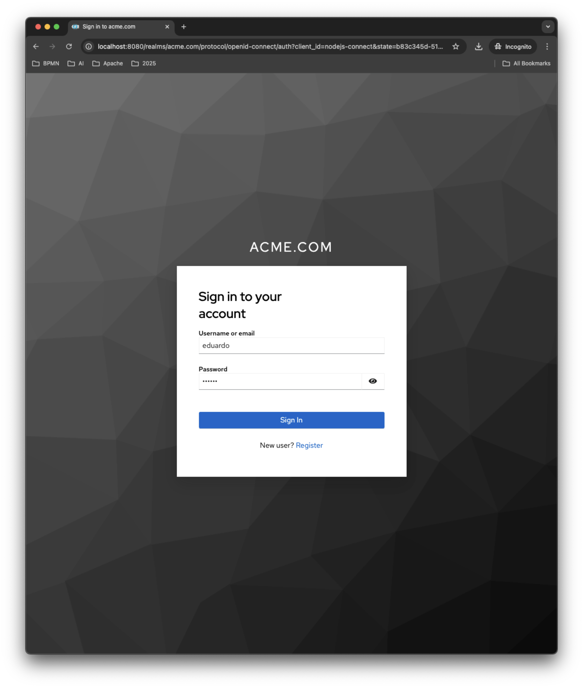

# app-keycloak-SSO

It is a Basic app using SSO keycloak. Realm for ACME with users and two roles user and admin. `it is an example and for learning purpose`.

[](acme_login_info.png)
[](acme_login_info.png)
[](keycloak_realm.png)

>> see screenshots in full size at [acme_app](./doc/acme_app.md) and [create_realm](./doc/create_realm.md)

## Development mode

### Run keycloack in docker and load ACME realm

```
docker run --platform linux/amd64 --name keycloak -p 8080:8080 -e KC_BOOTSTRAP_ADMIN_USERNAME=admin -e KC_BOOTSTRAP_ADMIN_PASSWORD=admin quay.io/keycloak/keycloak:26.1.2 start-dev
```

Open [http://localhost:8080](http://localhost:8080) login with admin/admin credential.

Import pre-configured realm: 
1. [Create realm](http://localhost:8080/admin/master/console/#/master/add-realm)
1. Browse, in reasource file and select [config/realm-acme.json](./config/realm-acme.json) and create.
1. for reference, see screenshots [create_realm](./doc/create_realm.md)

OR Import REALM conf during container creation

``` 
export PATH_MY_REALM=/$HOME/app-keycloak-SSO/config/
docker run --platform linux/amd64 --name keycloak -p 8080:8080 \
        -e KC_BOOTSTRAP_ADMIN_USERNAME=admin -e KC_BOOTSTRAP_ADMIN_PASSWORD=admin \
        -v $PATH_MY_REALM:/opt/keycloak/data/import \
        quay.io/keycloak/keycloak:26.1.2 \
        start-dev --import-realm
```

### Install and run app

```
npm install
npm start
```

Open [http://localhost:3000](http://localhost:3000) and login with one of users from ACME realm:

|    USER   | USERNAME  | PASSWORD |
| ----------|-----------|----------|
| Eduardo   | eduardo   | 123456   |
| Liza      | liza      | liza*123 | 


for reference, see screenshots [acme_app](./doc/acme_app.md)

## customizing Keycloak login

WIP...


# Links for reference
* [keycloak js adapter](https://www.keycloak.org/securing-apps/javascript-adapter)
* [Red Hat SSO Keycloak documentation](https://docs.redhat.com/en/documentation/red_hat_build_of_keycloak/22.0/html-single/securing_applications_and_services_guide/index#protecting_resources)
* [Keycloack node-js example](https://github.com/keycloak/keycloak-nodejs-connect/tree/main/example)
* [keycloak getting started](https://www.keycloak.org/getting-started/getting-started-docker#_secure_the_first_application)
* [Keycloack theme](https://www.keycloak.org/docs/latest/server_development/index.html#creating-a-theme)
